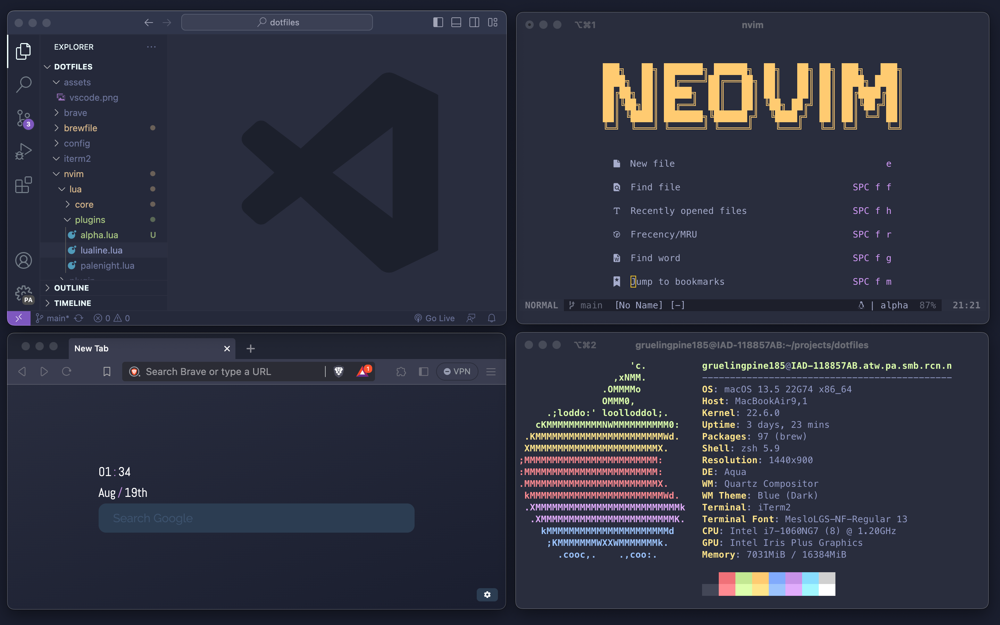
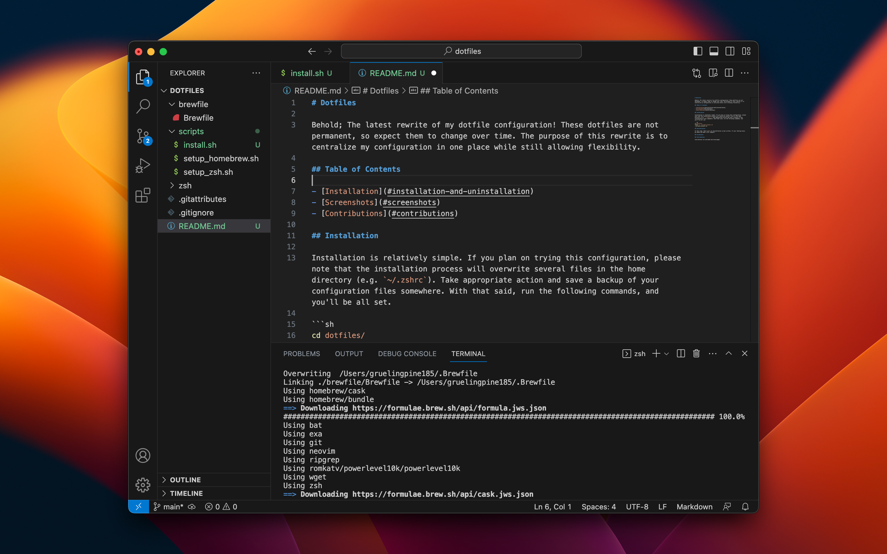

# Dotfiles



Behold; The latest rewrite of my dotfile configuration! These dotfiles are not permanent, so expect them to change over time. The purpose of this rewrite is to centralize my configuration in one place while still allowing flexibility.

## Table of Contents

- [Installation](#installation-and-uninstallation)
- [Screenshots](#screenshots)
- [Contributions](#contributions)

## Installation

Installation is relatively simple. If you plan on trying this configuration, please note that the installation process will overwrite several files in the home directory (e.g. `~/.zshrc`). Take appropriate action and save a backup of your configuration files somewhere. With that said, run the following commands, and you'll be all set.

```sh
cd dotfiles/
chmod +x ./scripts/install.sh
./scripts/install.sh
```
## Uninstallation

At this time, there isn't an uninstallation script written. If your feeling brave, go ahead and make a Pull Request.

## Screenshots



## Contributions

Contribtions are welcomed and encouraged.
